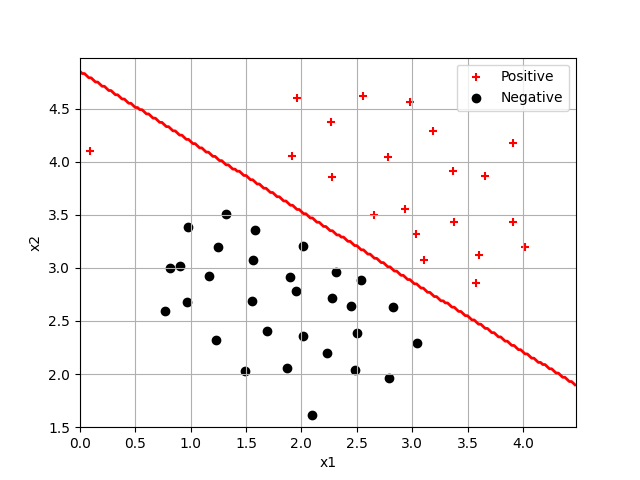
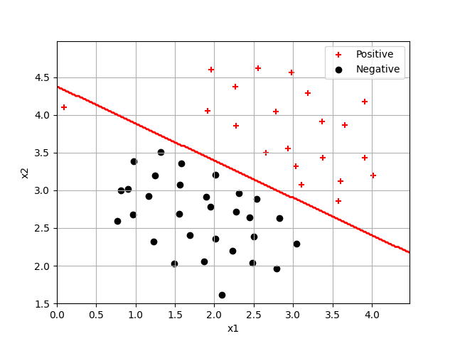
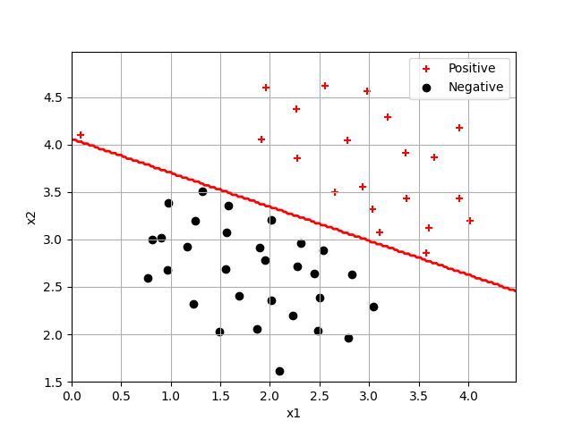
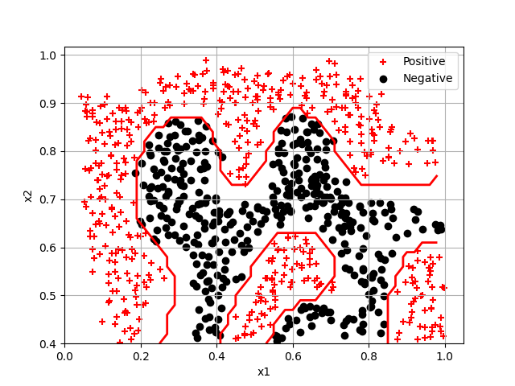
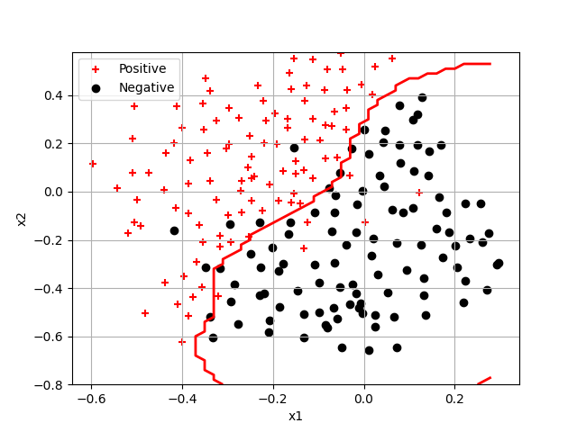

# SVM编程实践
## 1.探索SVM的超参数
直接调用sklearn库中的SVC函数，选择线性模型
当惩罚参数C = 1时，最左侧的正样本点被误分类（见下图） 

**不断尝试增大C到10，100，1000，10000** 

C = 10时（见下图） 

C = 100时，该样本点被正确分类（见下图） 

C = 1000， 10000时效果与C = 100相差不大

**完成gaussian kernel** 
计算两个样本之间的高斯核

使用高斯核对非线性边界样本点进行分类（见下图）

**尝试找到最佳参数** 
当前，C = 1, gamma = 0.125, 在数据集3上的分类效果（见下图）

注：由于dataset3param.py文件缺失，本任务并未完成

## 2.垃圾邮件分类

**完成processEmail，将邮件中的词汇映射为单词表的索引**

对emailSample1进行处理，结果如下： 

**tokens:** 

anyon
know
how
much
it
cost
to
host
a
web
portal
well
it
depend
on
how
mani
visitor
you
re
expect
thi
can
be
anywher
from
less
than
number
buck
a
month
to
a
coupl
of
dollarnumb
you
should
checkout
httpaddr
or
perhap
amazon
ecnumb
if
your
run
someth
big
to
unsubscrib
yourself
from
thi
mail
list
send
an
email
to
emailaddr

**word_indices:** 

[  86  916  794 1077  883  370 1699  790 1822 1831  883  431 1171  794
 1002 1893 1364  592 1676  238  162   89  688  945 1663 1120 1062 1699
  375 1162  479 1893 1510  799 1182 1237  810 1895 1440 1547  181 1699
 1758 1896  688 1676  992  961 1477   71  530 1699  531]

 **完成emailFeatures将得到的word_indices转化为统一维度（词典长度）的向量，用0/1代表是否出现** 

 测试验证：
 Length of feature vector: 1899
 Number of non-zero entries: 45

使用SVC模型进行预测，最终得到训练集上的准确率为99.825%；测试集上的准确率为98.9%

ex6_spam在最后给出了15个在分类器中取值最大的单词，结果如下：

wife (0.269724)
previous (0.267298)
player (0.261169)
mortgag (0.257298)
natur (0.253941)
ll (0.253467)
futur (0.248297)
hot (0.246404)

**使用训练的模型预测emailSample2，结果如下：**

predict ended: the result of data/emailSample2.txt is Email

predict ended: the result of data/spamSample1.txt is Spam

predict ended: the result of data/spamSample2.txt is Spam

完全正确！

**可选任务：**
构建自己的数据集，未完成